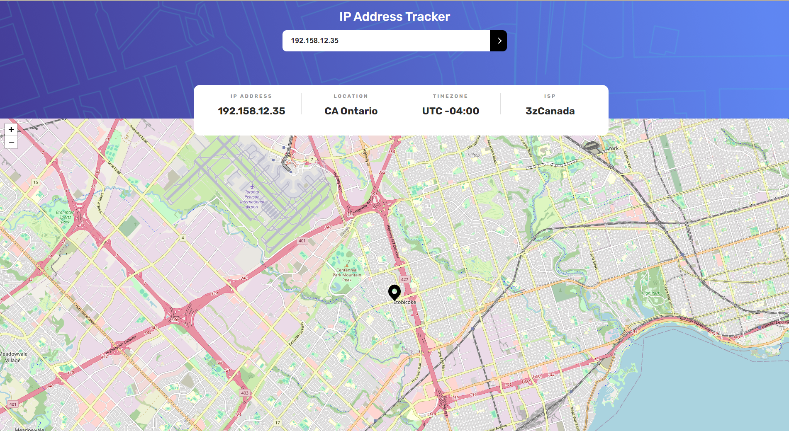

# IP Address Tracker

## Overview
The IP Address Tracker is a web application that allows users to track IP addresses and view their geographical locations 
on a map. Built using LeafletJS for mapping and the IP Geolocation API by IPify, this app provides a user-friendly 
interface to search for any IP address or domain and display key information.

## Features
- **Responsive Design**: The layout adapts to different screen sizes, providing an optimal experience on both mobile and desktop devices.
- **Interactive Elements**: Hover states for buttons and inputs enhance user interaction.
- **Automatic Location**: Users can view their own IP address and location on the map upon initial page load.
- **Search Functionality**: Users can search for any IP address or domain to retrieve and display relevant information.

## Technologies Used
- **HTML5**: For structuring the content.
- **CSS3**: For styling and responsive design.
- **TypeScrips**: For interactivity and API integration.
- **LeafletJS**: For rendering interactive maps.
- **IP Geolocation API by IPify**: For fetching IP address data.

### Screenshot

### Links

- Live Site URL: [https://main--ip-task-tracker.netlify.app/](https://main--ip-task-tracker.netlify.app/)